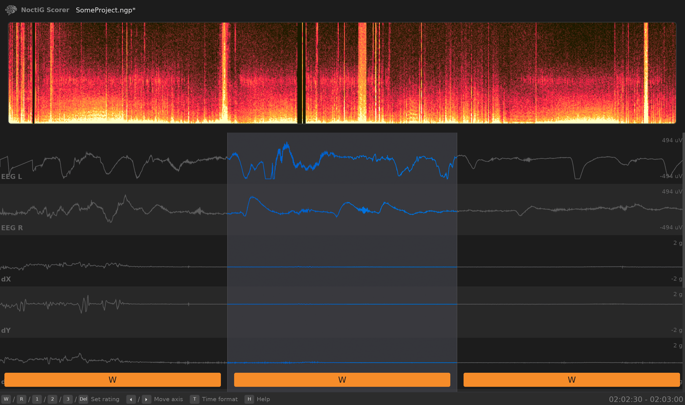

<h1>
  <picture>
    <source srcset="resources/icon.png" media="(prefers-color-scheme: dark)">
    <source srcset="resources/icon_dark.png" media="(prefers-color-scheme: light)">
    
  </picture>
  NoctiG Scorer
</h1>

A cross platform tool for manual sleep scoring written in Rust. It is capable of loading and visualizing signals from EDF files. The focus is on an intuitive usage primarily with the keyboard to speed up your workflow. **This tool is in an early development stage and not yet considered stable**

&nbsp;

## Current features
The current state of this application allows you to do the following:
* Create and configure projects
* Load multiple EDF files and display their signals
* Score epochs as Wake/REM/N1/N2/N3
* Easily accessible and readable data (Stages stored in JSON file, etc.)

## Future ideas
Here are some features which are currently missing, but ***might*** be implemented in the future:
* More advanced synchronization of signals
* Customizable keymaps
* Defining sleep stats (e.g. sleep latency, etc.)
* Feature detection algorithms (e.g. spindle detection, etc.)
* Real-time signal streaming to the application
* Assistive auto-scoring

## 🚀 Installation
As of now, there are no pre-built binaries available. This will change as soon as basic functionalities are implemented in the future.

### NixOS
Simply run `nix-shell` and `cargo run` in the project root.

### Windows / Linux / macOS
Install the [Rust compiler](https://rust-lang.org/tools/install/) and run `cargo run` in the project root.
> NOTE: This application has not been tested on macOS and might not be working as expected

## Usage
The entire project creation / loading / saving process is currently implemented in a very basic way and will be improved in the future.

### Creating a project
1. Open the application
2. Select the `New Project` option
3. Follow the steps in the project creation wizard. Tags are optional and the options on the last page are not yet implemented
4. Finally, click the `Create` button

### Loading a project
1. Open the application
2. Select the `Open existing` option
3. Browse for the `*.ngp` file in an existing project directory

### Saving a project
* Press the key combination `Ctrl + S` in the currently open project

## ⚠️ Disclaimer
I (the developer of this tool) am not a scientist, doctor or similar. I am just a programmer who maintains this tool as a hobby because it is the application I wish existed. This means it is possible that some features of this tool do not work as they should (due to lack of scientific knowledge or similar). This tool is not intended for medical treatment or diagnosis. This software is offered "as is" and it could contain errors, bugs or vulnerabilities which could lead to unexpected or undesireable consequences. If you encounter such problems, feel free to report them in the issues section. Keep in mind that this application is still in a very early development stage and not yet considered stable. I cannot and do not accept any liability for damages related to the use of this sofware. Use it at your own risk.

## Contributing
Unless you explicitly state otherwise, any contribution intentionally submitted for inclusion in the work by you, as defined in the Apache-2.0 license, shall be dual licensed as below, without any additional terms or conditions.

## 📜 License
This project is licensed under either of

* Apache License, Version 2.0 [[LICENSE-APACHE](LICENSE-APACHE)]
* MIT License [[LICENSE-MIT](LICENSE-MIT)]

at your option.

